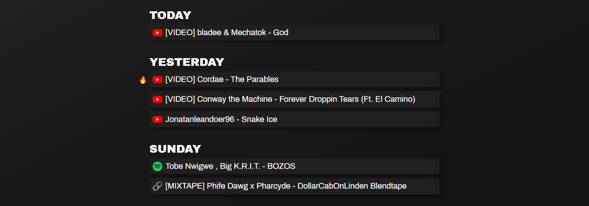

# [Raphunt](https://rdey0.github.io/raphunt/)

    
    
    
    
    
    

<h1></h1>

## [Demo](https://rdey0.github.io/raphunt/)

## Description

Raphunt is a web application which finds all of the fresh rap and hip hop songs in the past week so you dont have to. Raphunt makes it easy to keep up with the latest hip hop releases and 

## How to Use

Simply click on any of the displayed songs and you'll be redirected to it's respective streaming platform. Songs are grouped based on their day of release (Today, Yesterday, etc) and are sorted based on popularity (most to least). The most popular songs of the week will be marked with a fire emoji.

 

 
    

 

## How it Works

### Gathering Songs

Raphunt uses the Reddit API to access posts in [r/HipHopHeads](https://www.reddit.com/r/hiphopheads/), a lively community of hip hop enthusiasts who are always quick to post new and trending song releases. Raphunt finds such posts, parses the title and link, and then shows them to you.

### Rating Song Releases

Raphunt finds the standard deviation and mean of the upvotes each song received and then rates the popularity of each song based on the number of standard deviations it's upvotes are from the mean. Songs with a sufficiently high deviation from the mean are given a fire emoji.

